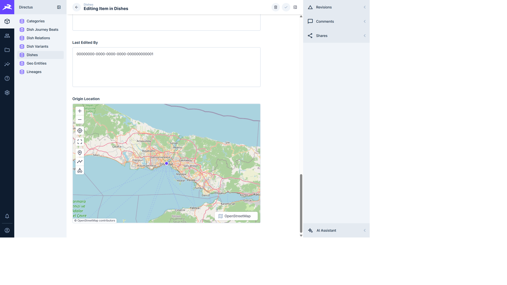
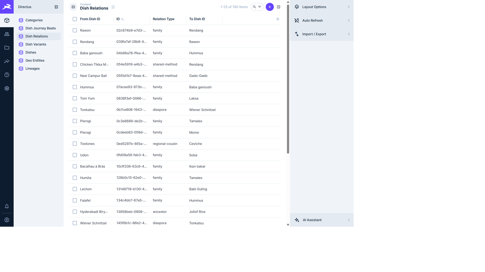
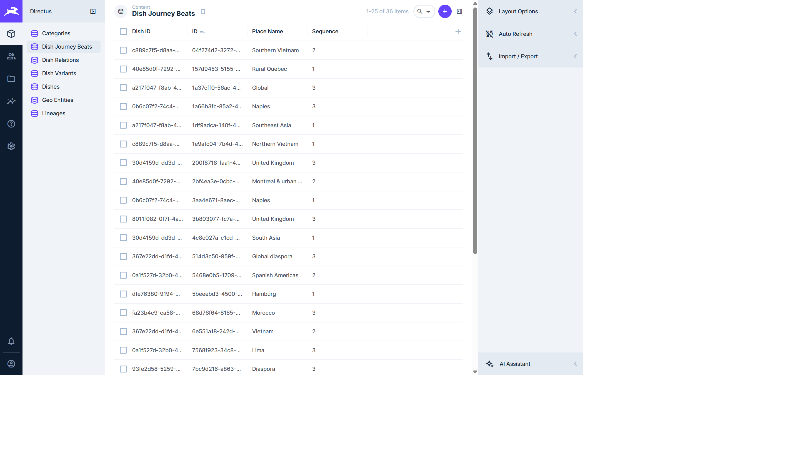
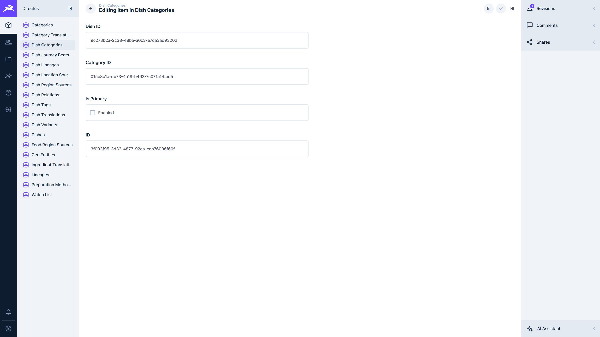
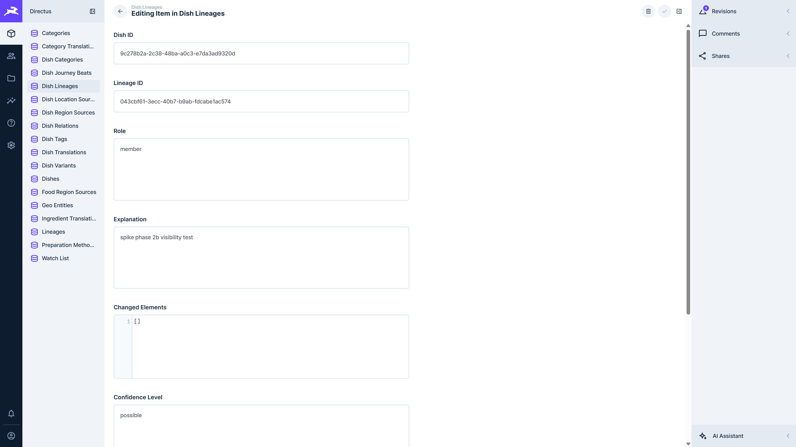
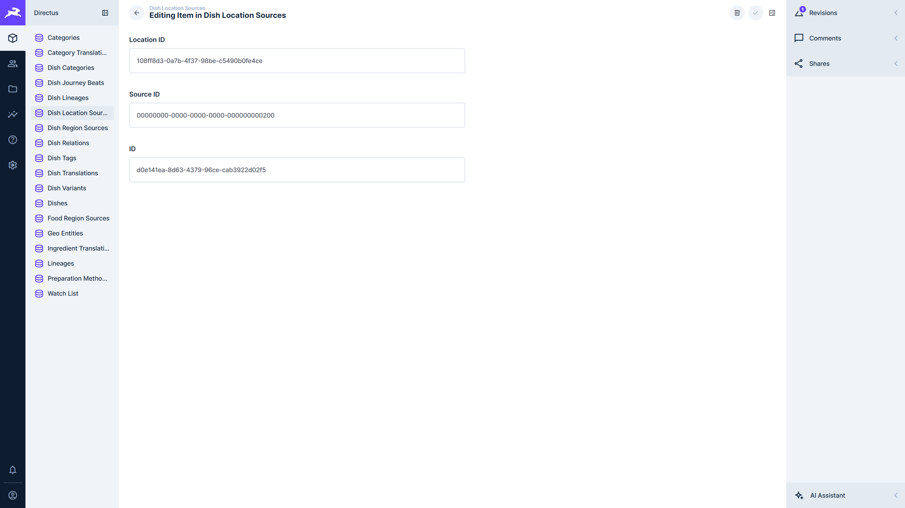

# ADR-002 Spike Findings — Directus over Gustale Postgres

**Branch:** `spike/directus-evaluation`  
**Date:** 2026-07-25  
**Scope:** Local-only evaluation against a seeded Postgres 16 + PostGIS DB. No VPS changes. No PR to main.  
**Directus:** `directus/directus:11` (runtime reported **11.17.4**; image tag `11`)  
**Database:** `gustale_directus_spike` (migrations + `SEED_ALLOW_ORPHANS=1` seed → 121 dishes, 190 dish_relations, 36 journey beats)

> **Note:** `docs/ADR-002-directus-admin.md` was **not present** in the repo at `origin/main` when this spike started. Evaluation followed the spike brief in chat.

---

## Recommendation

**PROCEED WITH CAVEATS**

Q1 (PostGIS) and Q2 (self-referential relations) — the two ADR kill criteria — both work after light Directus field/collection configuration. They do **not** fail the spike. Proceeding still requires honest Phase-2 work on write safety (Zod bypass), composite-PK translation tables Directus ignores, and accepting `directus_*` tables in `public` (or a fragile dual-schema setup).

---

## Environment

| Piece | Detail |
|---|---|
| Postgres | Docker `gustale-postgres` :5432, PostGIS enabled |
| Content DB | Fresh DB + all `packages/db/drizzle/*.sql` via seed migrator + seed data |
| Directus | Docker Compose (`docs/_spike-directus-compose.yml`), port **8055**, introspected existing schema |
| Content schema mutation | Not performed. Only Directus **meta** was patched (`directus_collections` / `directus_fields`) to reveal collections and set interfaces |
| Geometry column type | `geometry(Geometry,4326)` on `dishes.origin_location`, `geo_entities.centroid`, `dish_variants.region_location` — values are `POINT` |

Startup log (important for Q3): Directus **warns and ignores** every composite-PK junction/translation table:

```
WARN: Collection "dish_translations" doesn't have a primary key column and will be ignored
WARN: Collection "category_translations" ...
WARN: Collection "ingredient_translations" ...
WARN: Collection "preparation_method_translations" ...
WARN: Collection "dish_categories" / "dish_ingredients" / "dish_tags" / "dish_lineages" / "watch_list" ...
```

---

## Q1 — PostGIS geometry (BLOCKING)

### Verdict: **WORKS WITH CONFIG**

### Evidence

1. **Introspection:** Directus types `origin_location` as `geometry` (`GET /fields/dishes` → `type: "geometry"`, `schema.data_type: "GEOMETRY"`). Initial `meta` was `null`.
2. **Default UI:** After revealing the `dishes` collection and setting `meta.interface = "map"` (geometryType Point), the dish edit screen renders an **editable MapLibre/OpenStreetMap map** with a point marker — not opaque WKB/text.
3. **Read path:** Existing seeded points return as GeoJSON, e.g. musakka-turkish → `{ type: "Point", coordinates: [28.9784, 41.0082] }`.
4. **Write path (API):** Creating a dish with GeoJSON Point succeeds; PostGIS stores a real point:

   ```
   spike-directus-… | POINT(106.8456 -6.2088) | lng=106.8456 lat=-6.2088
   ```

   EWKT string body (`SRID=4326;POINT(...)`) **fails** (Directus expects GeoJSON for this field).
5. **Map endpoint:** Gustale `/api/dishes/map` was not re-pointed at the spike DB in this session. Round-trip was verified at the **PostGIS column** the map endpoint reads (`origin_location`). Same geometry, same SRID 4326.
6. **Caveat on column type:** Schema declares generic `geometry(Geometry,4326)`, not `geometry(Point,4326)`. Directus Map still works when configured as Point; drawing line/polygon tools appear in the UI but are inappropriate for dish origins.

### Screenshot



*Musakka dish edit: Origin Location as interactive map centered on Istanbul with place-point controls.*

### Kill-criteria call

**Not a kill.** Editors can place a dish point on a map after collection reveal + map interface config.

---

## Q2 — Self-referential M2M / `dish_relations` (BLOCKING)

### Verdict: **WORKS WITH CONFIG**

### Evidence

1. Directus introspects both FKs (`from_dish_id`, `to_dish_id` → `dishes`) without confusion. Self-reference does **not** break the collection.
2. List view shows **190 items** with human-readable from/to labels and `relation_type` values (`family`, `regional-cousin`, `shared-method`, …).
3. Edit screen for `moussaka-greek → musakka-turkish`:
   - `relation_type` = `regional-cousin`
   - reason text visible/editable
   - **From Dish ID** / **To Dish ID** are M2O dropdown pickers (`select-dropdown-m2o`) showing `Moussaka (moussaka-greek)` / `Musakka (musakka-turkish)`
4. Created a **new** relation via Directus API (no SQL): `poutine → hamburger-american`, `relation_type=shared-method`, strength=2 — succeeded (`id=906712ea-…`).
5. UX shape: this is a **junction collection** (`dish_relations` as its own list/edit), not an inline O2M/M2M panel on the dish form by default. That is usable; wiring an alias M2M on `dishes` would be extra config, not required for authoring.

### Screenshots




### Kill-criteria call

**Not a kill.** Typed self-relations are visible and editable without SQL.

---

## Q3 — Translations

### Verdict: **FAILS (as Directus collections) / not “plain related collections”**

### Evidence

- All four translation tables use **composite primary keys** and no surrogate `id`.
- Directus startup: **ignored** (`doesn't have a primary key column`).
- Admin API as super-admin: `GET /items/dish_translations` → **FORBIDDEN** / collection does not exist.
- Therefore they do **not** appear as usable related collections, and Directus i18n does **not** pick them up out of the box.

### Implication

Acceptable-for-spike answer of “plain related collections” is **not** what happens. Fix options (out of spike scope): add surrogate PKs, or keep translations out of Directus and edit via API/SQL. This is a **major caveats** item, not an ADR kill (kills are only Q1/Q2).

---

## Q4 — Schema isolation (`directus_*` tables)

### Verdict: **WORKS WITH CAVEATS**

### Evidence

1. **Default install:** 29 `directus_*` tables landed in **`public`** alongside Gustale content (prefix isolation only).
2. **Dedicated schema attempt:** With `DB_SEARCH_PATH=directus` on an empty DB, bootstrap created **27** `directus_*` tables in schema `directus` successfully.
3. **Dual path:** Restarting with `DB_SEARCH_PATH=directus,public` **crashed** bootstrap (`ERROR 42701` column name collision). Container never became healthy.
4. Directus maintainers document that multi-schema / “system tables elsewhere, content in public” is **not first-class**; Knex `withSchema` is not applied globally.

### How (if you insist)

1. `CREATE SCHEMA directus;`
2. Bootstrap Directus with `DB_SEARCH_PATH=directus` only.
3. Either move content into that same schema, or accept unsupported dual-schema experiments (we saw breakage).

### Practical recommendation for Gustale

Keep `directus_*` in `public`, exclude `directus_%` from Drizzle/Atlas diffs (standard pattern). Do not plan Phase 2 around a clean schema split unless Directus adds real multi-schema support.

---

## Q5 — Ordered children (`dish_journey_beats.sequence`)

### Verdict: **WORKS (integer field only)**

### Evidence

- Field type: `integer`; `meta.interface` / `special` empty → **plain number input**, not drag-to-reorder.
- List view shows Sequence as 1 / 2 / 3 integers among 36 beats.
- Contiguous sequencing is **not** enforced by Directus UI; only by seed validator / app logic.

### Screenshot



### Note

Directus *can* get drag-sort via a configured sort field (`special: ['sort']`) on a dedicated sort column — not present out of the box here. Integer field is survivable as the brief allows.

---

## Q6 — Write safety (Zod bypass)

### Verdict: **CONFIRMED — Directus bypasses API Zod; DB checks only sometimes save you**

### Evidence

| Attempt | Result |
|---|---|
| Journey beat `confidence: "totally-invalid-confidence"` | **Blocked** by Postgres `dish_journey_beats_confidence_check` |
| Dish `origin_location` Point with coordinates `[999, 999]` | **Accepted** by Directus; stored as `POINT(999 999)` in PostGIS |
| Empty/invalid relation types, missing wikipediaSlug, etc. | No Gustale Zod layer involved |

So: ADR-002’s warning is correct. Phase 2 constraints (DB CHECKs, triggers, Directus validation rules / Flows, or forcing writes through the API) are **urgent if Directus is adopted** — invalid latitudes already land in the atlas geometry column.

---

## Other findings (not in Q1–Q6 but material)

- Composite-PK **junction** tables (`dish_categories`, `dish_ingredients`, `dish_tags`, `dish_lineages`) are also ignored — category/ingredient authoring via those links is broken in Directus until surrogate keys exist.
- Better Auth tables (`user`, `session`, `account`, …) appear as collections if revealed — risk of editors touching auth data; hide aggressively.
- Collections start **hidden** until `meta.hidden=false` is set — expected for existing-DB introspect, not a blocker.

---

## Kill criteria (honest)

| Criterion | Outcome |
|---|---|
| Q1 fails → abandon | **Did not fail** (works with map interface config) |
| Q2 fails → abandon | **Did not fail** (junction + M2O pickers work) |

Therefore: **do not abandon on kill criteria.** Choose **PROCEED WITH CAVEATS** because of Q3/Q6/Q4 and ignored junctions — enough to make Phase 2 real work, not a free lunch.

---

## One-line recommendation

**PROCEED WITH CAVEATS** — PostGIS map editing and typed dish↔dish relations work; plan Phase 2 for Zod-bypass constraints, composite-PK tables Directus ignores, and `directus_*` living in `public`.

---

## Follow-up — Phase 2b surrogate PKs (2026-07-25)

**Trigger:** [ADR-002 Amendment 1](./ADR-002-directus-admin.md#amendment-1--composite-primary-keys-block-eleven-tables)  
**Migration:** `packages/db/drizzle/0010_surrogate_pks.sql`  
**Scope:** All eleven composite-PK tables listed in Amendment 1.

### Pre-migration row counts (`gustale`, seeded)

| Table | Rows |
|---|---:|
| `dish_categories` | 353 |
| `dish_translations` | 120 |
| `dish_lineages` | 34 |
| `dish_tags` | 0 |
| `category_translations` | 0 |
| `ingredient_translations` | 0 |
| `preparation_method_translations` | 0 |
| `food_region_sources` | 0 |
| `dish_region_sources` | 0 |
| `dish_location_sources` | 0 |
| `watch_list` | 0 |

None exceeded 50k. Natural-key checksums for all eleven tables were **identical** before and after `0010`.

### Constraint-name surprise

Drizzle named the old composite PKs `<table>_<cols>_pk` (e.g. `dish_categories_dish_id_category_id_pk`), **not** `<table>_pkey`. Migration drops those verified names. New PK is `<table>_pkey`; natural key is `<table>_natural_key` (except the three empty translation tables already converted in `0009`, which keep `*_language_unique`).

### Directus re-check

After applying `0010` (and, on the spike DB, the historically missing `0005_food_geography_phase_2a.sql` so the three `*_sources` tables exist), Directus startup **no longer ignores** any of the eleven. Remaining ignored collection: `dish_ingredients` (still has **no** primary key at all — out of Amendment 1 scope).

API write verification (then UI screenshots):

1. **`dish_categories`** — created a category assignment for `moussaka-greek` → `main-course`
2. **`dish_lineages`** — attached lineage `curry-spiced-stew` with role `member`
3. **`dish_location_sources`** — cited location `Athens — spike citation target` to an existing `sources` row

### Screenshots



*Editing a `dish_categories` row: surrogate `ID` present; Dish ID + Category ID + Is Primary editable.*



*Editing a `dish_lineages` row created in this re-check (`spike phase 2b visibility test`).*



*Editing a `dish_location_sources` citation: Location ID + Source ID + surrogate `ID`.*

### Note on journal drift

`0005_food_geography_phase_2a.sql` exists on disk but is **not** in `drizzle/meta/_journal.json`, so some DBs (including the original spike) lacked `food_region_*` / `dish_*_sources` until applied manually. `0010` skips those three tables when missing so migrator runs do not abort mid-file.

---

## Follow-up — Phase 2b `dish_ingredients` PK (0011)

**Migration:** `packages/db/drizzle/0011_dish_ingredients_pk.sql` (separate from 0010; SHA published independently).

**Natural key:** `UNIQUE NULLS NOT DISTINCT (dish_id, ingredient_id, variant_id)` — see migration header. Seeder never sets `variant_id`, but the column exists so a dish may pin multiple variants of one ingredient; two-column UNIQUE would block that. `NULLS NOT DISTINCT` closes the duplicate-NULL hole.

**Directus:** after apply + restart, startup no longer warns on `dish_ingredients`. Collection is visible and returns rows with surrogate `id`. **12 / 12** Amendment tables editable.
